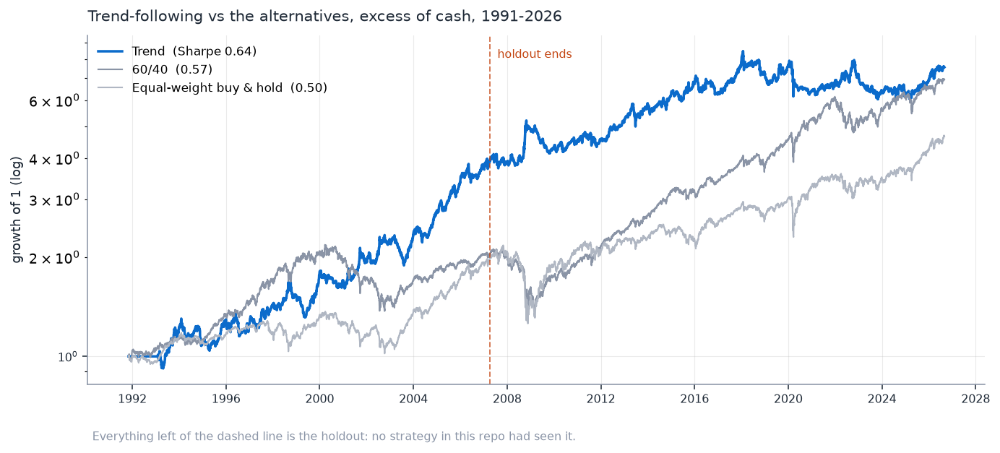
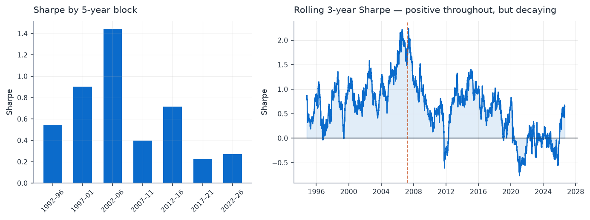
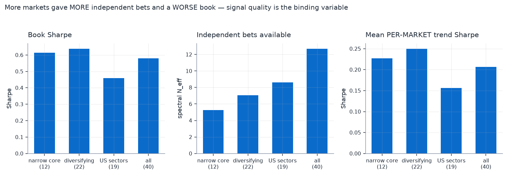
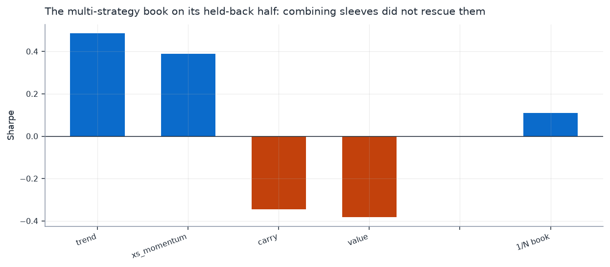

# Quorum

Two questions about systematic trading, answered on 35 years of multi-asset data
with a holdout that was never looked at until the end.

1. **Does running several strategies beat running one?** No — not on this data,
   and the reason is measurable.
2. **Is there a tradeable edge here at all?** One: trend-following, at a Sharpe
   of 0.64 on a clean holdout, decaying, with a ceiling I can locate precisely.

Everything is tested — 109 tests, including ones that corrupt the future and
assert the past does not move. Where a result changed after a bug was found, the
old number and the correction are both in the [engineering log](ENGINEERING.md).

---

## The edge

40 funds across equity, rates, credit and real assets, **1991-11 to 2026-08**.
Trend-following is a 12-month time-series momentum signal (Moskowitz-Ooi-Pedersen
specification, not tuned here), inverse-volatility sized, monthly rebalanced,
5bps costs, in excess of cash.



| | Holdout 1991–2007 | 2007–2026 | Full 34.8y | t (NW) |
|---|---|---|---|---|
| **Trend** | **0.971** | 0.374 | **0.635** | **3.31** |
| 60/40 | 0.516 | 0.607 | 0.568 | 3.70 |
| Equal-weight buy & hold | 0.691 | 0.434 | 0.499 | 2.84 |

It beats both alternatives at roughly **half the maximum drawdown**, and the
2008 spike in the chart is the crisis convexity trend is actually bought for.

Combining trend with its two nearest relatives (multi-horizon trend,
cross-sectional momentum) reaches **0.737, t = 4.03** — they carry 1.93
independent bets between them, so the combination is worth about the +0.10 it
adds. But that book was formed by keeping what was positive in *both* periods,
which used the holdout to select. **Trend alone is the clean number**, and it is
the one quoted above.

**Why the holdout matters.** 1991–2007 predates every ETF in the original study,
so no strategy in this repo had ever been run on it. The signal's parameters come
from published work rather than from this sample. It is a genuine out-of-sample
test of the one thing that looked good in 2007–2026.

### It is real, and it is decaying



Positive in **all seven** 5-year blocks — but 1.44 in 2002–06 against 0.23 in
2017–21. That is consistent with the [~50% post-publication decay the crowding
literature documents](https://arxiv.org/pdf/2512.11913), and with AQR's finding
that [managed-futures alpha largely *is* the time-series momentum
factor](https://www.aqr.com/-/media/AQR/Documents/Insights/Journal-Article/Demystifying-Managed-Futures.pdf).
This is a known risk premium, not a secret.

### What survives multiple-testing correction

**53** configurations were tested across this repo — 30 ETF-study cells, 12
reversal repair variants, 6 literature candidates, 4 breadth universes and 1
signal variant. Reporting the best one's Sharpe unadjusted would be reporting the
maximum of 53 draws.

| | Raw | BHY haircut | Deflated Sharpe |
|---|---|---|---|
| Trend | 0.635 | **0.567**, significant at 5% | 0.892 *(bar is 0.95)* |
| 3-sleeve book | 0.737 | **0.678**, significant | 0.967 — clears it |

The Benjamini-Yekutieli haircut needs only the trial count, not an assumption
about the null's spread, which is why it is the number quoted. The deflated
Sharpe depends on how that spread is estimated and the two defensible
conventions disagree (0.26 vs 0.89 for trend) — both are reported in
`reports/research_edge.txt` rather than the flattering one being picked.

---

## The ceiling, and why it is a data problem

Two improvements were specified from theory **before** testing. Both failed.



| Universe | Markets | Sharpe | Independent bets | Mean per-market Sharpe |
|---|---|---|---|---|
| narrow core | 12 | 0.611 | 5.26 | 0.227 |
| **diversifying only** | 22 | **0.635** | 7.07 | **0.250** |
| US sectors only | 19 | 0.456 | 8.62 | 0.156 |
| all | 40 | 0.577 | **12.69** | 0.206 |

**More markets gave more independent bets and a worse book.** The 40-market
universe holds 12.69 independent bets against the core's 5.26 — and scores
lower, because 18 of the additions are US equity sectors whose per-market trend
Sharpe is ~30% weaker. Equal-weighting across markets means that dilutes
directly.

> This corrects a wrong conclusion previously published here. The first version
> claimed effective bets *fell* from 1.35 to 1.06. That metric was degenerate:
> the portfolio-level Meucci count returns exactly 1 for **any** positive
> correlation when weights are equal, so it could not distinguish ρ=0.05 from
> ρ=0.9. `risk.spectral_bets` replaces it for breadth questions, and there are
> tests pinning both behaviours.

The tanh continuous-response signal — the construction the literature actually
uses — delivered its predicted turnover reduction (9.7 vs 11.7 round trips) and
a *lower* Sharpe (0.563 vs 0.635).

**So the binding constraint is data.** Raising this needs markets that are both
independent *and* trend well: currencies, international rates, physical commodity
futures. None is available free with 1991 history. A real managed-futures
programme trades 50–200 such markets, and that is the whole distance between
0.64 and the ~1.0 those programmes report.

---

## Does multi-strategy diversification pay?

The original question, run on 15 ETFs over 2007–2026 with a
selection/confirmation split: four sleeves (trend, cross-sectional momentum,
carry, value) across six capital allocators.



| Book | Confirmation-half Sharpe |
|---|---|
| All four sleeves, 1/N | +0.109 |
| Walk-forward edge gate | −0.090 |
| Vetted three, hindsight | +0.293 |
| **Single best sleeve (trend)** | **+0.485** |

Three findings worth the space:

**Diversification is not edge.** Two sleeves lost money out of sample. Combining
them with two that worked produced something worse than the good one alone,
however the capital was split.

**Which sleeves you fund matters more than how you weight them.** On the
confirmation half, concentrating moved Sharpe by 0.49, sleeve selection by 0.13,
and the entire best-to-worst allocator spread by 0.10. This reproduces
DeMiguel-Garlappi-Uppal: no optimiser beat 1/N out of sample, and minimum
variance — which uses the most estimated inputs — was worst.

**Vetting sleeves walk-forward destroys value.** Selecting sleeves *once* with
9.5 years of hindsight gives +0.293. Doing the same thing honestly — every month,
on a rolling two years — gives **−0.090**. A two-year Sharpe has a standard error
near 0.7; the gate is mostly reacting to noise. That is this repo's own top
recommendation failing its own test.

Also measured: trend and cross-sectional momentum correlate **0.66** — separate
entries on every strategy list, built on the same 12-month signal. And short-term
reversal earns 0.285 gross, −0.081 net, at 70 round trips a year; it was cut
after twelve repair variants were searched and the best scored −0.132 out of
sample.

---

## Method

The parts that decide whether any number above means anything.

- **Corrupted-future tests.** Replace all prices after a cutoff, re-run, assert
  nothing before it moved. The corruption must be *asset-specific* — an earlier
  version scaled every future price uniformly, which leaves cross-sectional ranks
  intact, so four of five sleeves were never actually tested.
- **One shift, in one place.** A weight decided at the close of day *t* earns the
  return *t→t+1*. If sleeves also shifted, the result would be merely
  conservative and undetectable.
- **Split by date, decided once.** The allocator is chosen on the first half; the
  second is scored once. Where that holdout was later spent, the repo says so and
  moves to fresh data rather than reusing it.
- **Newey-West everywhere.** A monthly-rebalanced book holds the same position
  for twenty days, so daily returns are autocorrelated and the plain t-statistic
  overstates the evidence.
- **Costs on turnover**, scaled by trailing volatility, including the initial
  trade from flat. Spreads widen exactly when a de-risking overlay wants to trade.
- **Excess returns throughout.** The sample spans 0% and 5%+ policy rates.

## Layout

```
src/universe.py           15 ETFs, 2007-2026
src/extended.py           40 funds, 1991-2026, and the breadth findings
src/data.py               cached fetch, excess returns
src/sleeves/base.py       rules enforced centrally; class neutralisation, no-trade band
src/sleeves/strategies.py the sleeves and the literature candidates
src/allocators.py         1/N, inverse vol, ERC, min variance, Sharpe tilt, edge gate
src/risk.py               shrinkage, asymmetric vol, adaptive throttle, breadth metrics
src/portfolio.py          per-sleeve vol targeting, walk-forward combination, netting
src/backtest.py           the shift, volatility-scaled costs, metrics
src/deflated.py           deflated Sharpe and multiple-testing haircuts

scripts/research_edge.py    the 35-year edge study with the 1991-2007 holdout
scripts/run_study.py        the multi-strategy study
scripts/audit.py            a structural audit of a two-tier allocation spec
scripts/reversal_search.py  the search that cut a sleeve
scripts/make_charts.py      the four charts above
```

## Running it

```bash
python -m venv .venv && .venv/Scripts/activate
pip install -r requirements.txt

python -m scripts.fetch_data     # once: caches the ETF universe to data/
python -m scripts.run_study      # the multi-strategy study
python -m scripts.research_edge  # the 35-year edge study (fetches on first run)
python -m scripts.make_charts

pytest -q                        # 109 tests, no network needed
```

Outputs land in `reports/` (committed, so the numbers above are checkable without
running anything) and `charts/`.

## Limits, stated plainly

- **One sample.** 35 years and six regimes is far better than 19 and two, but it
  is still one history.
- **Nothing clears the strictest bar.** The deflated Sharpe is 0.892 against a
  0.95 convention. The BHY haircut is significant; the two disagree and both are
  shown.
- **Mutual fund NAVs are not exchange prices.** They are struck once daily, and
  international funds carry stale-pricing autocorrelation. Every signal here is
  21 days or longer, where it is negligible, and dropping the flagged fund
  *improves* the result — but it is a real caveat and `VTRIX` is marked.
- **Survivorship.** These funds still exist. `VCVSX` was liquidated in 2021 and
  is excluded, which is itself an instance of the problem.
- **No shorting frictions.** Borrow costs and availability are ignored.
- **The commodity carry signal is a proxy.** Roll yield is estimated from a
  front-month and a laddered crude fund, then applied to a broad commodity index.
- **53 trials on one panel.** Further searching here makes the surviving number
  less trustworthy, not more.
